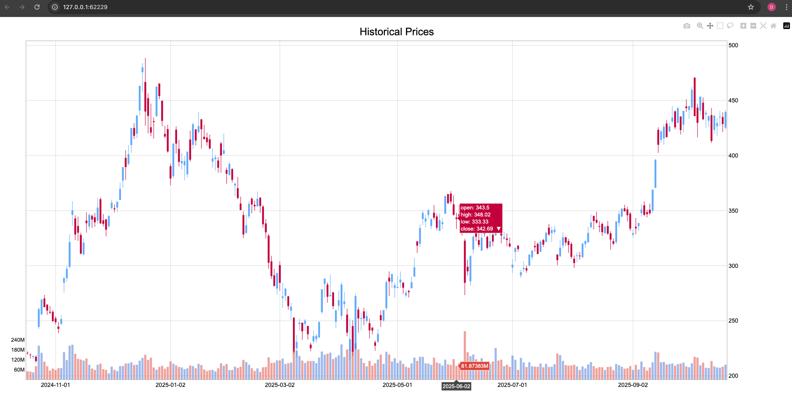

<!-- markdownlint-disable MD012 MD031 MD033 MD037 -->

import HeadTitle from "@site/src/components/General/HeadTitle.tsx";
import NewReferenceCard from "@site/src/components/General/NewReferenceCard";

<HeadTitle title="OpenBB Charting | OpenBB Docs" />

This extension provides a charting library for Open Data Platform by OpenBB.

The library includes:

- API charting infrastructure
- Mutable `chart` attribute in every response object
- Plotly charting components
- Pre-built charts for a set of endpoints
- Optional extra for dedicated window creation
  - Includes an interactive `table()` method in the Python Interface

:::note
*The charting library is an `OBBject` extension, which means you'll have the functionality it exposes on every command result.*
:::

## Installation

To install the extension, run the following command in this folder:

```bash
pip install openbb-charting
```

### Extras

The PyWry dependency handles the display of interactive charts and tables in a separate window.

Add the PyWry extra for standalone window creation.

```sh
pip install "openbb-charting[pywry]"
```

### PyWry on Linux

For Linux systems, the PyWry dependency requires certain dependencies to be installed first.

- Debian-based / Ubuntu / Mint:
`sudo apt install libwebkit2gtk-4.0-dev`

- Arch Linux / Manjaro:
`sudo pacman -S webkit2gtk`

- Fedora:
`sudo dnf install gtk3-devel webkit2gtk3-devel`

## Set Theme

The default theme setting is `dark`, and this can be changed to "light" in the [user preference](/odp/python/settings/user_settings/preferences)
for both, `chart_style` and `table_style`.

For the current Python session, set them with:

```python
from openbb import obb

obb.user.prefernces.chart_style="dark"
obb.user.prefernces.table_style="light"

```

## Available Charts

Not all the endpoints are supported by the charting extension. To discover which endpoints are supported, you can run the following command:

```python
from openbb_charting import Charting
Charting.functions()
```

This produces the same result as using the class method from the `OBBject.charting` function response.

```console
Methods
-------
show
    Display chart and save it to the OBBject.
to_chart
    Redraw the chart and save it to the OBBject, with an optional entry point for Data.
functions
    Return a list of Platform commands with charting functions.
get_params
    Return the charting parameters for the function the OBBject was created from.
indicators
    Return the list of the available technical indicators to use with the `to_chart` method and OHLC+V data.
table
    Display an interactive table.
create_line_chart
    Create a line chart from external data.
create_bar_chart
    Create a bar chart, on a single x-axis with one or more values for the y-axis, from external data.
create_correlation_matrix
    Create a correlation matrix from external data.
toggle_chart_style
    Toggle the chart style, of an existing chart, between light and dark mode.
```

## Usage

:::important user_settings.json
This extension requires that the [user preference](/odp/python/settings/user_settings/preferences) for `output_type` is set to, "OBBject", the default state.
:::

To use, run any of the ODP Python Package endpoints with the `chart` argument set to `True`.

```python
>>> from openbb import obb
>>> equity_data = obb.equity.price.historical(symbol="TSLA", chart=True)
>>> equity_data

OBBject[T]

id: 068ec8c8-9ea2-78dc-8000-97703428789b
results: [{'date': datetime.date(2024, 10, 14), 'open': 220.1300048828125, 'high': ...
provider: yfinance
warnings: None
chart: {'content': {'data': [{'close': {'dtype': 'f8', 'bdata': 'AAAAwB5la0AAAACAPX...
extra: {'metadata': {'arguments': {'provider_choices': {'provider': 'yfinance'}, 's...
```

The chart will be returned in the response object under the `chart` attribute.

Display the current figure by calling:

```python
equity_data.show()
```

<details>
<summary mdxType="summary">Sample Chart</summary>



</details>

### Chart Params

:::note
When a supported endpoint is called with `chart=True`, chart parameters can be passed as a nested dictionary under the name, `chart_params`.

```python
chart_params = dict(
    title="AAPL 50/200 Day EMA",
    indicators=dict(
        ema=dict(length=[50,200]),
    ),
)
params = dict(
    symbol="AAPL",
    start_date="2022-01-01",
    provider="yfinance",
    chart=True,
    chart_params=chart_params,
)
data = obb.equity.price.historical(**params)
```
`chart_params` are sent in the body of the request when using the API.
:::

Passing only `chart=True` will return a default view which can be modified and drawn again post-request, via the `OBBject`.

```console
OBBject

id: 06614d74-7443-7201-8000-a65f358136a3
results: [{'date': datetime.date(2022, 1, 3), 'open': 177.8300018310547, 'high': 18...
provider: yfinance
warnings: None
chart: {'content': {'data': [{'close': [182.00999450683594, 179.6999969482422, 174....
extra: {'metadata': {'arguments': {'provider_choices': {'provider': 'yfinance'}, 's...
```

```python
data.show()
```

<details>
<summary mdxType="summary">Sample Chart With EMA</summary>


</details>

### Endpoints Without Charts

Most functions do not have dedicated charts. However, it's still possible to generate one automatically. Try passing it through a quantitative analysis command.

```python
data = obb.equity.price.historical(
    symbol="XLK",
    start_date="2023-01-01",
    provider="yfinance",
)
qa = obb.quantitative.rolling.stdev(data.results, target="close")

qa.charting.show(title="XLK Rolling 21 Day Standard Deviation")
```

<details>
<summary mdxType="summary">Sample Generic Line Chart</summary>


</details>

### Tables

Interactive tables are displayed by the `table` method.

:::important
This functionality is intended for response object exploration and is not suitable for production environments.
:::

```python
data = obb.equity.price.quote("AAPL,MSFT,GOOGL,META,TSLA,AMZN", provider="yfinance")
data.charting.table()
```

<details>
<summary mdxType="summary">Sample Interactive Table</summary>


</details>

External data can also be supplied, providing an opportunity to filter or apply Pandas operations before display.

```python
new_df = df.to_df().T
new_df.index.name="metric"
new_df.columns = new_df.loc["symbol"]
new_df.drop("symbol", inplace=True)
data.charting.table(data=new_df)
```

<details>
<summary mdxType="summary">Sample Custom Data Table</summary>


</details>
